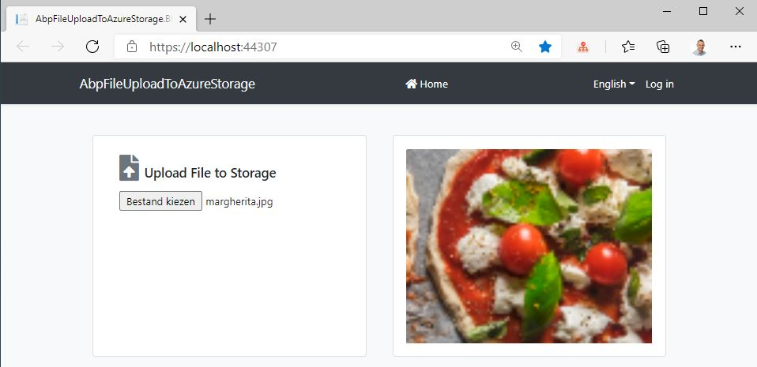
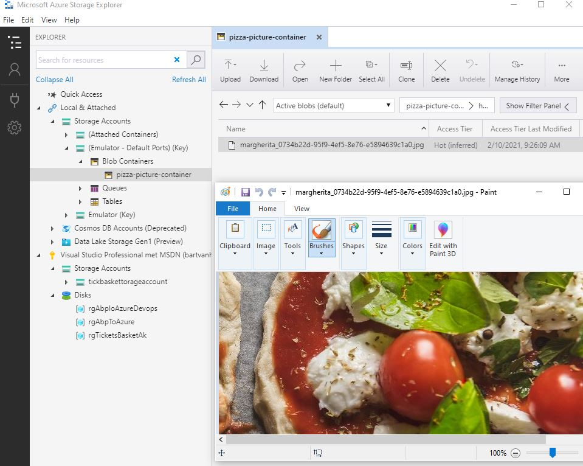

## Upload/Download Files to Azure Storage with the ABP Framework

## Introduction

In this article you will learn how to setup and use the **Blob Storing Azure Provider** to **Upload/Download files to Azure Storage** in a **Blazor APB Framework** application.

To keep this article as simple as possible, I will only show the steps to upload a file to Azure Storage. In the accompanying source code you can find the code you need to Download or Delete a file from Azure Storage.

I made use of Azurite (an emulator for local Storage Development) so you don't actually need to set up an Azure Storage account in Azure to follow along. You will need to replace the connection string in the appsettings.json file in het HttpApi.Host project if you want to upload/download files to a real Azure Storage account in Azure.

### Source Code

The Source code of the completed application is [available on GitHub](https://github.com/bartvanhoey/AbpFileUploadToAzureStorage).

## Requirements

The following tools are needed to be able to run the solution and follow along.

* .NET 5.0 SDK
* VsCode, Visual Studio 2019 16.8.0+ or another compatible IDE
* Microsoft Azure Storage Explorer. Download it [here](https://azure.microsoft.com/en-us/features/storage-explorer/)
* Azurite (Emulator for local Azure Storage development). Read more about it [here](https://docs.microsoft.com/en-us/azure/storage/common/storage-use-azurite).

## Tools needed

### Install and run Azurite

* Open a command prompt and install **Azurite** by using NPM.

```bash
  npm install -g azurite
```

* Create an azurite folder in your c-drive (c:\azurite).
* start **Azurite emulator** from a command prompt with admin privileges.

```bash
  azurite --silent --location c:\azurite --debug c:\azurite\debug.log
```

Alternatively you could also run Azurite as a docker container (see [docs](https://docs.microsoft.com/en-us/azure/storage/common/storage-use-azurite) how to proceed).

### Install and configure Microsoft Azure Storage Explorer

* Download and install [Azure Storage Explorer](https://azure.microsoft.com/en-us/features/storage-explorer/). A free tool to easily manage your Azure cloud storage resources anywhere, from Windows, macOS, or Linux.
* Click on the **Open Connect Dialog** icon in the left menu.
* Select **Attach to a local emulator** and click **Next**, keep default settings, click **Connect**.
* Do not forget to start your emulator, Storage Explorer will not start it for you.

## Create and Run Application

### Creating a new ABP Framework Application

* Install or update the ABP CLI:

```bash
dotnet tool install -g Volo.Abp.Cli || dotnet tool update -g Volo.Abp.Cli
```

* Use the following ABP CLI command to create a new Blazor ABP application:

```bash
abp new AbpFileUploadToAzureStorage -o AbpFileUploadToAzureStorage -u blazor
```

### Open & Run the Application

* Open the solution in Visual Studio (or your favorite IDE).
* Run the `AbpFileUploadToAzureStorage.DbMigrator` application to apply the migrations and seed the initial data.
* Run the `AbpFileUploadToAzureStorage.HttpApi.Host` application to start the server side.
* Run the `AbpFileUploadToAzureStorage.Blazor` application to start the Blazor UI project.

## Development

### Install Volo.Abp.BlobStoring.Azure NuGet package to Domain project

* Open a command prompt in the directory of the **Domain** project.
* Run the command below to install **Volo.Abp.BlobStoring.Azure** NuGet package
  
```bash
  abp add-package Volo.Abp.BlobStoring.Azure
```

### Create a class AzureStorageAccountOptions to retrieve Azure Storage settings

* Create an **AzureStorage** folder in the **Domain** project of your application.
* Add a **AzureStorageAccountOptions.cs** file to the **AzureStorage** folder.

```csharp
namespace AbpFileUploadToAzureStorage
{
  public class AzureStorageAccountOptions
  {
    public string ConnectionString { get; set; }
    public string AccountUrl { get; set; }
  }
}
```

### Add AzureStorageAccountSettings to the appsettings.json file in the HttpApi.Host project

```json
{
  // other settings here

  "AzureStorageAccountSettings" : {
    "ConnectionString" : "AccountName=devstoreaccount1;AccountKey=Eby8vdM02xNOcqFlqUwJPLlmEtlCDXJ1OUzFT50uSRZ6IFsuFq2UVErCz4I6tq/K1SZFPTOtr/KBHBeksoGMGw==;DefaultEndpointsProtocol=http;BlobEndpoint=http://127.0.0.1:10000/devstoreaccount1;QueueEndpoint=http://127.0.0.1:10001/devstoreaccount1;TableEndpoint=http://127.0.0.1:10002/devstoreaccount1;",
    "AccountUrl" : "http://127.0.0.1:10000/devstoreaccount1/"
  }
}
```

The connection string above serves as connection to Azurite (local Azure Storage emulator). You will need to replace the connection string when you want to upload files to Azure Storage in the cloud.

### Create a ConfigureAzureStorageAccountOptions method in the AbpFileUploadToAzureStorageDomainModule class of the Domain project

```csharp
    // Comment out and place in using section page
    // using Microsoft.Extensions.Configuration;
    
    private void ConfigureAzureStorageAccountOptions(ServiceConfigurationContext context, IConfiguration configuration)
    {
      Configure<AzureStorageAccountOptions>(options =>
      {
        var azureStorageConnectionString = configuration["AzureStorageAccountSettings:ConnectionString"];
        var azureStorageAccountUrl = configuration["AzureStorageAccountSettings:AccountUrl"];

        options.ConnectionString = azureStorageConnectionString;
        options.AccountUrl = azureStorageAccountUrl;
      });
    }
```

### Call the ConfigureAzureStorageAccountOptions method from the ConfigureServices method in the AbpFileUploadToAzureStorageDomainModule

```csharp
    public override void ConfigureServices(ServiceConfigurationContext context)
    {
      // ...

      var configuration = context.Services.GetConfiguration();
      ConfigureAzureStorageAccountOptions(context, configuration);
    }
```

### Add a PizzaPictureContainer class in the Domain project

* Add a **PizzaPictureContainer.cs** file to the **AzureStorage/Pizzas** folder of the **Domain** project.

```csharp
using Volo.Abp.BlobStoring;

namespace AbpFileUploadToAzureStorage.Domain.AzureStorage
{
    [BlobContainerName("pizza-picture-container")]
    public class PizzaPictureContainer
    {
        
    }
}
```

### Create a ConfigureAbpBlobStoringOptions method in the AbpFileUploadToAzureStorageDomainModule of the Domain project

```csharp
    // Comment out and place in using section page
    // using Volo.Abp.BlobStoring;
    // using AbpFileUploadToAzureStorage.Domain.AzureStorage;


    private void ConfigureAbpBlobStoringOptions(IConfiguration configuration)
    {
      Configure<AbpBlobStoringOptions>(options =>
      {
        var azureStorageConnectionString = configuration["AzureStorageAccountSettings:ConnectionString"];
        options.Containers.Configure<PizzaPictureContainer>(container =>
        {
          container.UseAzure(azure =>
                {
                  azure.ConnectionString = azureStorageConnectionString;
                  azure.CreateContainerIfNotExists = true;
                });
        });
      });
    }
```

### Call the ConfigureAbpBlobStoringOptions method from the ConfigureServices method in the AbpFileUploadToAzureStorageDomainModule

```csharp
    public override void ConfigureServices(ServiceConfigurationContext context)
    {
      // ...

      var configuration = context.Services.GetConfiguration();
      ConfigureAzureStorageAccountOptions(context, configuration);
      
      ConfigureAbpBlobStoringOptions(configuration);
    }
```

### Create PizzaPictureContainerManager class in folder AzureStorage/Pizzas of the Domain project

```csharp
using System;
using System.IO;
using System.Threading.Tasks;
using Microsoft.Extensions.Options;
using Volo.Abp.BlobStoring;
using Volo.Abp.Domain.Services;

namespace AbpFileUploadToAzureStorage.Domain.AzureStorage.Pizzas
{
  public class PizzaPictureContainerManager : DomainService
  {
    private readonly IBlobContainer<PizzaPictureContainer> _pizzaPictureContainer;
    private readonly AzureStorageAccountOptions _azureStorageAccountOptions;

    public PizzaPictureContainerManager(IBlobContainer<PizzaPictureContainer> pizzaPictureContainer, IOptions<AzureStorageAccountOptions> azureStorageAccountOptions)
    {
      _pizzaPictureContainer = pizzaPictureContainer;
      _azureStorageAccountOptions = azureStorageAccountOptions.Value;
    }

    public async Task<string> SaveAsync(string fileName, byte[] byteArray, bool overrideExisting = false)
    {
      var extension = Path.GetExtension(fileName);
      var storageFileName = $"{Path.GetFileNameWithoutExtension(fileName)}_{Guid.NewGuid()}{extension}";
      await _pizzaPictureContainer.SaveAsync(storageFileName, byteArray, overrideExisting);
      return storageFileName;
    }
  }
}
```

### Add IPizzaAppService, SavePizzaPictureDto and SavedPizzaPictureDto to the Application.Contracts project

```csharp
using System.Threading.Tasks;
using Volo.Abp.Application.Services;

namespace AbpFileUploadToAzureStorage.Application.Contracts.AzureStorage.Pizzas
{
  public interface IPizzaAppService : IApplicationService
  {
    Task<SavedPizzaPictureDto> SavePizzaPicture(SavePizzaPictureDto input);
  }
}
```

```csharp
namespace AbpFileUploadToAzureStorage.Application.Contracts.AzureStorage.Pizzas
{
  public class SavePizzaPictureDto
  {
    public string FileName { get; set; }
    public byte[] Content { get; set; }
  }
}
```

```csharp
namespace AbpFileUploadToAzureStorage.Application.Contracts.AzureStorage.Pizzas
{
  public class SavedPizzaPictureDto
  {
    public string StorageFileName { get; set; }
  }
}
```

### Add a PizzaAppService class in the Application project and implement IPizzaAppService interface

```csharp
using System.Threading.Tasks;
using AbpFileUploadToAzureStorage.Application.Contracts.AzureStorage.Pizzas;
using AbpFileUploadToAzureStorage.Domain.AzureStorage.Pizzas;
using Volo.Abp.Application.Services;

namespace AbpFileUploadToAzureStorage.Application.AzureStorage.Pizzas
{

  public class PizzaAppService : ApplicationService, IPizzaAppService
  {
    private readonly PizzaPictureContainerManager _pizzaPictureContainerManager;

    public PizzaAppService(PizzaPictureContainerManager pizzaPictureContainerManager)
    {
      _pizzaPictureContainerManager = pizzaPictureContainerManager;
    }

    public async Task<SavedPizzaPictureDto> SavePizzaPicture(SavePizzaPictureDto input)
    {
      var storageFileName = await _pizzaPictureContainerManager.SaveAsync(input.FileName, input.Content, true);
      return new SavedPizzaPictureDto { StorageFileName = storageFileName };
    }
  }
}
```

### Replace content of Index.razor with code below

```html
@page "/"
@inherits AbpFileUploadToAzureStorageComponentBase
<div class="container">
    <CardDeck>
        <div class="card mt-4 mb-5">
            <div class="card-body">
                <div class="col-lg-12">
                    <div class="p-12">
                        <h5><i class="fas fa-file-upload text-secondary pr-2 my-2 fa-2x"></i>Upload
                            File to Azure Storage
                        </h5>
                        <p>
                            <InputFile OnChange="@OnInputFileChange" />
                        </p>
                    </div>
                </div>
            </div>
        </div>
        <div class="card mt-4 mb-5">
            <div class="card-body">
                <CardImage Source="@PictureUrl" Alt="Pizza picture will be displayed here!"></CardImage>
            </div>
        </div>
    </CardDeck>
</div>
```

### Replace content of Index.razor.cs with code below

```csharp
using System;
using System.Linq;
using System.Threading.Tasks;
using AbpFileUploadToAzureStorage.Application.Contracts.AzureStorage.Pizzas;
using Microsoft.AspNetCore.Components;
using Microsoft.AspNetCore.Components.Forms;

namespace AbpFileUploadToAzureStorage.Blazor.Pages
{
  public partial class Index
  {
    [Inject] protected IPizzaAppService PizzaAppService { get; set; }
    public SavedPizzaPictureDto SavedPizzaPictureDto { get; set; } = new SavedPizzaPictureDto();
    protected string PictureUrl;

    protected async Task OnInputFileChange(InputFileChangeEventArgs e)
    {
      var file = e.GetMultipleFiles(1).FirstOrDefault();
      var byteArray = new byte[file.Size];
      await file.OpenReadStream().ReadAsync(byteArray);

      SavedPizzaPictureDto = await PizzaAppService.SavePizzaPicture(new SavePizzaPictureDto { Content = byteArray, FileName = file.Name }); ;

      var format = "image/png";
      var imageFile = (e.GetMultipleFiles(1)).FirstOrDefault();
      var resizedImageFile = await imageFile.RequestImageFileAsync(format, 100, 100);
      var buffer = new byte[resizedImageFile.Size];
      await resizedImageFile.OpenReadStream().ReadAsync(buffer);
      PictureUrl = $"data:{format};base64,{Convert.ToBase64String(buffer)}";
    }
  }
}

```

## Test Uploading a picture to Azure Storage

* Start both the Blazor and the HttpApi.Host project.
* Choose a pizza picture in the **File Upload to Azure Storage** section.
  


Et voilà! As you can see in the **Azure Storage Explorer**, the pizza picture has been successfully stored in **Azure Storage**.



Congratulations, you can upload a file to Azure Storage by now! Check out the source code of this article to see my implementation of Uploading/Deleting a file to Azure Storage.

Find more info about **Blob Storing** [here](https://docs.abp.io/en/abp/latest/Blob-Storing) and **BLOB Storing Azure Provider** [here](https://docs.abp.io/en/abp/latest/Blob-Storing-Azure).

Get the [source code](https://github.com/bartvanhoey/AbpFileUploadToAzureStorage) on GitHub.

Enjoy and have fun!
